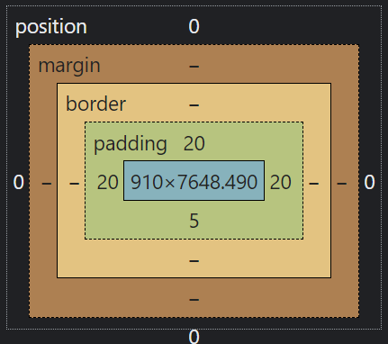

# 【CSS】布局
#### 旧版浏览器添加HTML5
从https://github.com/aFarkas/html5shiv/下载html5shiv.js文件，在html\<head>元素内添加\<script>。
```html
<head>
<!--[if lt IE 9]>
  <script src="js/html5shiv.js">
  </script>
<![endif]-->
</head>
```
#### 默认样式重置 | 标准化
- 重置
  **Meyer** [http://meyerweb.com/eric/tools/css/reset]
- 标准化
  **normalize.css** [https://github.com/necolas/normalize.css/]
  
#### 盒模型
- **标准盒模型**：width & height 只包含content
- **怪异盒模型**：width & height 包含padding和border
```css
box-sizing: border-box; /* 切换成怪异盒模型 */
```


---

#### 1. 显示类型
```css
display: block/inline/inline-block/none;
/* inline 忽略 width/height/margin 等块级元素特征，接受 padding 设置
 * 但 padding-top 与 padding-bottom 会越界进入相邻元素区域
 * none 元素不可见，且不占据视觉空间
 */
```
#### 2. 可见性
```css
visibility: hidden/visible/collapse; /* 保留空白空间 */
/* collapse: 当在表格元素中使用时，此值可删除一行或一列，但是它不会影响表格的布局。被行或列占据的空间会留给其他内容使用。如果此值被用在其他的元素上，会呈现为 "hidden"。 */
```
#### 3. 高度和宽度【不继承】
```css
width: w; /* 长度或百分数或默认的auto（右边距常常调整以填补空白） */
height: h; /* 只能为长度或默认的auto */
```
尽量选用min-height而不是height，使内容超出高度时元素高度自动按需增长。
#### 4. 内边距【不继承】
```css
padding: 5px; /* 四边 */
padding: 5px 9px; /* 上下 左右 */
padding: 5px 9px 11px; /* 上 左右 下 */
padding: 5px 9px 11px 0; /* 上 右 下 左 */
padding-top: x; /* -right/bottom/left 下同 */
```
#### 5. 边框【不继承】
```css
border-style: none(default)/dotted/dashed/solid/double/groove/ridge/inset/outset;
border-width: n;
border-color: color; /* 默认为元素的color */
border-image: url;
border: style width color; /* 不提供style会导致style默认为none*/
```
#### 6. 外边距【不继承】
```css
margin: x; /* 默认为auto，依赖于width属性*/
/* 相邻上下两个元素的margin仅选取大的一个，左右两元素不叠加 */
```
> Attention:
> 当em用于内边距和外边距时，em的值是相对于元素的字体大小的，而不是相对于父元素的字体大小。

#### 7. 浮动以及浮动控制【不继承】
浮动元素display会变成block。
```css
float: left/right/none;
/* 使用width显示设置元素的宽度，留出空间 */
```
控制浮动
- 浮动元素不会影响父元素的高度，为了让父元素能包含浮动元素，需要让父元素“自清除”
  - 样式表引入.clearfix规则，为父元素添加clearfix类 
  - overflow
- 阻止被浮动
  - 用clear阻止元素浮动在该元素的左/右/两边
```css
clear: left/right/both/none;
```

#### 8. 定位【不继承】
##### 相对定位
相对于在文档流的自然位置进行偏移，在原先位置留下空白，其它元素不受影响。
```css
position: relative;
top: d; /* d-偏移量，right/bottom/left同 */
```
##### 绝对定位
相对于其祖先元素进行偏移，脱离正常文档流，与其它元素互相独立。
```css
position: absolute;
top: d; /* d-偏移量，right/bottom/left同 */
```
为希望称为绝对定位参照体的祖先元素添加设置，不添加则会相对body进行偏移。
```css
position: relative;
```
##### 栈定位
```css
z-index: n; /* 指定叠放次序，n越大，显示的层数越高，对静态定位无用 */
```
#### 9. 溢出【不继承】
```css
overflow: visible/scroll/hidden/auto;
```
#### 10. 垂直对齐
仅用于行内元素。
```css
vertical-align: baseline/middle/sub/super;
vertical-align: text-top/text-bottom/top/bottom/百分比/值;
```
#### 11. 修改鼠标指针
```css
cursor: 指针形状;
/* pointer-手指; default-箭头; crosshair-加号; 
 * move-移动标志; wait-沙漏; help-箭头+问号;
 * text-输入标志; progress- 箭头+沙漏 
 */
```
